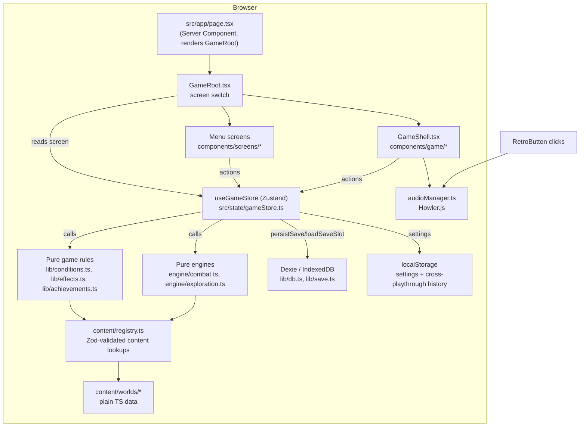

# ARCHITECTURE.md

## System overview

ANIME//SIM is a **fully client-side Next.js application** — there is no
backend server, no database server, and no network calls at runtime beyond
loading static assets and Google Fonts at build time. Everything (game
logic, save persistence, audio) runs in the player's browser. The entire
route surface is one page (`src/app/page.tsx`) that renders a single React
component (`GameRoot`), which is a pure client-side state machine driven by
one Zustand store.

## Frontend / backend structure

There is no backend. "Frontend structure" is the whole app:

- **`src/app/`** — Next.js App Router shell. `layout.tsx` (Server
  Component: fonts, metadata, viewport) wraps `page.tsx` (Server Component:
  renders `<GameRoot />`, a Client Component). This is the only place the
  Server/Client Component boundary exists in the app — everything under
  `GameRoot` is client-rendered.
- **`src/components/GameRoot.tsx`** — a `"use client"` component that reads
  `screen: Screen` from the store and does a `switch` to render the right
  top-level screen. This is the entire "router" — there is no
  file-based or config-based routing beyond it; navigating between, say,
  the title screen and the character creator is a `setScreen()` store call,
  not a URL change.
- **`src/components/screens/`** — menu-level screens shown before/around a
  save (Boot, Title, WorldSelect, CharacterCreator, SaveSelect, Settings,
  Codex, Achievements, PatchNotes, Credits).
- **`src/components/game/GameShell.tsx`** — shown when `screen === "game"`.
  Reads `save.mode` (`"dialogue" | "exploration" | "combat" | "device" |
  "recap"`) and renders the matching in-game view
  (`DialogueView`/`ExplorationView`/`CombatView`/`DeviceMenuFullScreen`/
  `ChapterRecapScreen`), plus always-mounted overlays (`DeviceMenu` modal,
  `DebugPanel`, `NotificationToasts`). Also owns three side-effect
  `useEffect`s: periodic autosave + playtime tracking (every 20s),
  accessibility `data-*` attribute sync, and tab-visibility tracking (to
  pause CSS animations when backgrounded).

## Server / client boundaries

There is effectively one boundary: `src/app/layout.tsx` and
`src/app/page.tsx` are Server Components (they don't use hooks/state), and
`GameRoot` and everything under it is `"use client"`. Nothing renders on
the server beyond the static shell — no data fetching happens
server-side, because there is no data to fetch from a server.

## Request lifecycle

1. Browser requests `/`. Next.js serves the (statically generated, since
   there's no dynamic server data) HTML shell from `layout.tsx`/`page.tsx`.
2. React hydrates `GameRoot`. The Zustand store initializes with `screen:
   "boot"`, `save: null`.
3. `BootScreen` plays a boot sequence, then the player reaches `TitleScreen`,
   which offers "Continue" (calls `continueFromAutosave()` → reads the
   `autosave` Dexie slot) or "New Game" (`worldSelect` → `characterCreator`
   → `startNewGame()`).
4. Once a `save` exists, `screen` becomes `"game"` and `GameShell` takes
   over, driven entirely by `save.mode`.
5. Every meaningful action (a dialogue choice, an interaction, a combat
   move) goes through a `gameStore.ts` action, which calls into
   `lib/effects.ts`/`lib/conditions.ts`/`engine/*.ts`, produces a new
   `SaveGame` (and sometimes a new `CombatRuntimeState`), calls `set()`,
   and (for most actions) calls `saveGame()` to persist to IndexedDB.

## Data flow

`content/worlds/*` (plain data) → `content/registry.ts` (`parseAll`,
Zod-validated, indexed into `Map`s keyed by `id`, exposed via `getNpc`,
`getScene`, `getMap`, `getItem`, `getEnemy`, `getEncounter`,
`getAchievement`, `getChapter`, etc.) → read by `gameStore.ts` actions and
by `lib/conditions.ts`/`lib/effects.ts`/`engine/*.ts` → combined with the
current `SaveGame` (also validated by Zod, `types/save.ts`) → new
`SaveGame`/`CombatRuntimeState` → `set()` into the Zustand store → React
re-renders the subscribed components → (for most mutations) persisted to
IndexedDB via `lib/save.ts`'s `persistSave`.

## Auth / authz flow

None. There is no authentication or authorization anywhere in this app —
see `SECURITY.md`.

## DB access flow

`lib/db.ts` exports `db: AnimeSimDatabase | null` — `null` on the server
(`typeof window === "undefined"` guard, since Dexie needs IndexedDB, a
browser API) and a real Dexie instance in the browser. `lib/save.ts` wraps
every read/write with Zod validation:
- `persistSave(save)` → `SaveGameSchema.parse({...save, updatedAt:
  Date.now()})` → `db.saves.put(validated)`. Throws (`.parse`, not
  `.safeParse`) if the save object itself is malformed — this should never
  happen for saves produced by the app's own code, only if something
  hand-constructs a bad `SaveGame`.
- `loadSaveSlot(slotId)` → `db.saves.get(slotId)` → `SaveGameSchema.safeParse`
  → returns `null` on validation failure instead of throwing (a corrupted
  or schema-incompatible save fails to load silently rather than crashing
  the app).
- `exportSave`/`importSave` — JSON stringify/parse plus the same
  `.parse()` validation on import (throws on invalid/tampered JSON).

## Storage / external-API flow

- **IndexedDB (Dexie)** — save games only, see `DATABASE.md`.
- **`localStorage`** — two independent uses: (1) settings
  (`anime-sim-settings` key, `lib/save.ts`'s
  `save/loadSettingsFromLocalStorage`, read before any save exists so audio
  settings apply from the title screen), and (2) per-chapter
  cross-playthrough outcome history (`anime-sim-playthroughs-<chapterId>`
  key, written by `ChapterRecapScreen.tsx`, read to show "you got this
  ending on N previous playthroughs" style context).
- **No external APIs.** Zero `fetch`/`XMLHttpRequest`/WebSocket calls
  anywhere in `src/` (verified via repo-wide search for `process.env`
  usage — the only network-adjacent code is Next.js's own Google Fonts
  loading at build time via `next/font/google`, which is a build-time,
  not runtime, dependency).

## Real-time / background / scheduled jobs

None in the server sense. The only "background" behavior is a client-side
`setInterval` in `GameShell.tsx` that ticks playtime and autosaves every
20 seconds while a save is active — this is a browser timer, not a job
queue or scheduled task, and it only runs while the tab is open.

## Caching

None beyond the browser's normal HTTP/asset caching for static files and
whatever Next.js does automatically for its own build output. No
application-level cache layer exists (no React Query/SWR, no in-memory
content cache beyond the `Map`s built once at module-load time in
`content/registry.ts`, which function as a cache but were not designed as
one — they exist because Zod validation is a one-time cost paid at
import).

## Error handling

- **Content validation errors** (malformed data in `content/worlds/*`)
  throw at import time via Zod's `.parse()` in `registry.ts` — these
  surface as a hard crash during `pnpm dev`/`pnpm build`, which is the
  intended "fail loud, fail early" behavior for authoring mistakes.
- **Runtime data errors** (a corrupted save, a bad settings blob) use
  `.safeParse()` and degrade gracefully (see "DB access flow" above).
- **No React error boundaries exist anywhere in the app** (verified via
  grep for `componentDidCatch`/`ErrorBoundary` — zero matches). An
  unexpected runtime exception in any component will produce Next.js's
  default dev/prod error overlay rather than a graceful in-game fallback.
  This is a real gap, not yet flagged elsewhere — see `SECURITY.md`/
  `TESTING.md`.
- **`localStorage` access is wrapped in `try/catch`** in both `lib/save.ts`
  and `ChapterRecapScreen.tsx`, specifically to tolerate private-browsing
  mode / storage quota errors without crashing (settings/history simply
  don't persist in that case).

## Logging

No logging framework. Zero `console.log`/`console.warn`/`console.error`
calls anywhere in `src/` (verified via repo-wide grep) — the codebase is
clean of debug logging left in place. There is no analytics/telemetry.

## Deployment architecture

Not currently deployed — see `DEPLOYMENT.md`. In principle: a static/
client-rendered Next.js app with zero required environment variables,
deployable to Vercel (or any static host that can run `next build`/`next
start`) with no server-side configuration needed.

## Security boundaries

There are effectively none to enforce, because there is nothing to
protect — no accounts, no server-held data, no cross-user data of any
kind. The only "boundary" is the browser's own same-origin storage
isolation for IndexedDB/`localStorage`, which is standard browser behavior,
not anything this app implements. See `SECURITY.md` for the full defensive
review.

## Major architectural risks

1. **`SaveGameSchema` backward-compatibility discipline is the only thing
   protecting existing players' saves.** Adding a required field (as
   opposed to `.optional()`/`.default()`) silently breaks
   `loadSaveSlot`'s `safeParse` for every existing save. The
   `unlockedChapterIds` field (added and committed in `4f6ac3e`) did this
   correctly (as a `.default([])`), but the discipline has to be
   maintained by hand on every future schema change — there's no
   automated migration system.
2. **No error boundaries.** A single uncaught exception anywhere in the
   game-mode component tree currently takes down the whole app rather than
   degrading a single screen/view.
3. **Content cross-reference integrity is not validated.** Zod validates
   each content object's *shape*, but nothing validates that a referenced
   `sceneId`/`npcId`/`itemId`/`mapId` actually exists elsewhere in the
   registry — this is exactly how the Floor 4–10 dangling-scene-reference
   issue went unnoticed by the type system and the build during
   development (it has since been fixed, in commit `4f6ac3e` — see
   `TASKS.md` → `TASK-003`). A future improvement could add a
   post-registry integrity pass that walks every `sceneId`/`npcId`/etc.
   reference and throws (or at least warns) on dangling ones, so the next
   content expansion can't reintroduce the same class of bug silently.
4. **Single Zustand store, no persistence of the `combat`/`notifications`
   runtime state.** If the tab reloads mid-combat, `combat` is lost (it's
   never persisted to IndexedDB) — the player would return to whatever
   `save.mode` last was without any renegotiation. Not confirmed broken by
   this audit (no runtime testing was performed — see `TESTING.md`), but
   the code path shows no explicit handling for "reload during combat."
