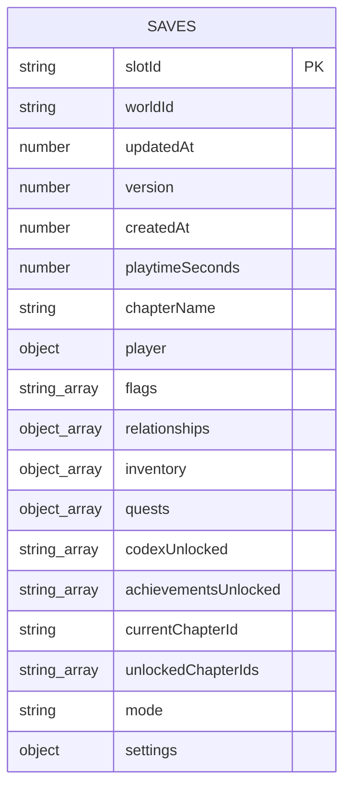

# DATABASE.md

## Provider

**Dexie.js (`^4.4.4`) over the browser's IndexedDB.** There is no
server-hosted database of any kind (no Postgres/MySQL/Mongo/Supabase/
Firebase/etc.). All persistence is local to the player's own browser
profile. `localStorage` is used for two small, separate, non-relational
pieces of data (settings, cross-playthrough outcome history) — see below.

## Schema location

`src/lib/db.ts`:

```ts
export class AnimeSimDatabase extends Dexie {
  saves!: Table<SaveGame, string>;
  constructor() {
    super("anime-sim-db");
    this.version(1).stores({
      saves: "slotId, worldId, updatedAt",
    });
  }
}
export const db = typeof window !== "undefined" ? new AnimeSimDatabase() : null;
```

## Entity-relationship diagram

There is exactly one table and no relations between rows (each row is a
fully self-contained `SaveGame` document). Shown as an ER diagram for
completeness:



`player`, `relationships`, `inventory`, `quests`, and `settings` are
nested JSON structures within the one `SAVES` row, not separate tables —
IndexedDB/Dexie has no concept of a join, so there is nothing to draw a
relationship line to.

## Tables

### `saves` (the only table)

One row per save slot. The **entire** `SaveGame` object (see
`src/types/save.ts`'s `SaveGameSchema`) is stored as a single record —
this is a document store, not a normalized relational schema.

| Field | Type | Notes |
|---|---|---|
| `slotId` | `string` | **Primary key.** Either a `uid("save")`-generated ID or the literal string `"autosave"` (`AUTOSAVE_SLOT_ID` constant in `lib/save.ts`). |
| `worldId` | `"elite-academy" \| "aincrad"` | Indexed. |
| `updatedAt` | `number` (ms timestamp) | Indexed; used to sort `listSaveSlots()` newest-first. |
| `version` | `z.literal(1)` | Save-format version, currently always `1`. Not itself a migration mechanism — see "Migration risks" below. |
| `createdAt`, `playtimeSeconds`, `chapterName` | number / number / string | — |
| `player` | `Player` (nested object) | Full character sheet — see `types/character.ts`: appearance, personality, strength/weakness, core stats (`CORE_STAT_KEYS`), world-specific stats (`elite`/`aincrad` sub-objects), difficulty. |
| `flags` | `string[]` | Every story flag ever set (never trimmed). |
| `relationships` | `RelationshipState[]` | One entry per NPC met — 7 axes + `mood` + `metPlayer` + secrets/memories (`types/npc.ts`). |
| `inventory` | `InventorySlot[]` | `{itemId, quantity, equipped}` (`types/item.ts`). |
| `quests` | `QuestProgress[]` | `{questId, state, completedObjectiveIds, outcome?}` (`types/quest.ts`). |
| `codexUnlocked`, `achievementsUnlocked` | `string[]` | Content IDs. |
| `currentChapterId` | `string` | — |
| `unlockedChapterIds` | `string[]` | **New in the uncommitted diff**, `.default([])`. |
| `currentSceneId`, `currentNodeId`, `currentMapId`, `currentSpawnId` | `string \| undefined` | Navigation cursor — which of these is set determines `mode`. |
| `mode` | `"dialogue" \| "exploration" \| "combat" \| "device" \| "recap"` | Drives `GameShell.tsx`'s view switch. |
| `guildId`, `classId` | `string \| undefined` | Aincrad guild / Elite Academy class, once chosen. |
| `partyMemberIds` | `string[]` | Aincrad companion NPCs currently partied. |
| `timeOfDay` | `string`, default `"morning"` | — |
| `dayCount` | `number`, default `1` | — |
| `safeZoneCheckpoint` | `{mapId, spawnId, chapterId, sceneId?} \| undefined` | Survival-mode defeat-rewind target. |
| `dialogueHistory` | `{speaker, text}[]` | Capped at the last 200 lines (`gameStore.ts`'s `logDialogueLine`). |
| `messages` | `{id, messageId, npcId, timestamp, read}[]` | Device Messages tab content. |
| `choiceLog` | `{sceneId, choiceId, text}[]` | Every dialogue choice ever made, used by `chapterOutcomes` derivation. |
| `settings` | `Settings` (`types/settings.ts`) | Per-save copy of settings (separate from the `localStorage` settings — see below). |

**No relations, no foreign keys, no joins** — Dexie/IndexedDB doesn't
support them, and the app doesn't need them since everything for one
playthrough lives in one record. Content (NPCs, items, scenes, etc.) is
never stored in the database — it's static, bundled TypeScript data
looked up by ID from `content/registry.ts` at runtime; only the *player's
progress against that content* (flags, relationships, inventory, …) is
persisted.

## Indexes

Exactly two, both declared in the `stores()` call: `worldId` and
`updatedAt` (plus the implicit primary-key index on `slotId`). No compound
indexes. No querying beyond `db.saves.orderBy("updatedAt").reverse()`
(`listSaveSlots`) and `db.saves.get(slotId)`/`db.saves.put(...)`/
`db.saves.delete(slotId)` (all in `lib/save.ts`).

## Constraints / enums

Enforced entirely by `SaveGameSchema` (Zod) at write time (`persistSave`,
via `.parse()` — throws on invalid data) and at read time (`loadSaveSlot`,
via `.safeParse()` — returns `null` on invalid data instead of throwing).
IndexedDB itself enforces none of this; Dexie just stores whatever object
shape it's given. Key enums: `worldId` (`"elite-academy" | "aincrad"`),
`mode` (5-value enum, see table above), `pronouns` (3-value, in
`types/character.ts`), `difficulty` (4-value: story/standard/strategist/
survival).

## Migrations

**One migration exists**, Dexie's own `this.version(1).stores({...})` — the
schema has never been versioned past 1. There is no migration *script* or
tooling to run; Dexie migrations are declared inline in `db.ts` and applied
automatically by the Dexie runtime the next time the database opens in a
browser that has an older version. **If the `saves` table's indexed fields
ever need to change** (not the stored object's shape — Dexie doesn't
enforce that — just the `slotId, worldId, updatedAt` index list), a new
`this.version(2).stores({...})` block would need to be added, keeping
`version(1)`'s block for existing installations to migrate through. This
has never been exercised in this repo.

**Save *object shape* migrations** (as opposed to Dexie index migrations)
are handled implicitly by Zod's `.default()`/`.optional()` — adding a new
optional field to `SaveGameSchema` doesn't require a Dexie version bump at
all, since Dexie doesn't validate the stored object's internal shape. See
`CLAUDE.md` → "DO NOT CHANGE WITHOUT REVIEW" for the backward-compatibility
discipline this depends on.

## Seeds

None — there is no seed data. A new save is constructed entirely from the
character creator's input plus static content lookups
(`gameStore.ts`'s `startNewGame`), not from any pre-populated database
record.

## RLS policies

Not applicable — IndexedDB is already scoped per-origin by the browser
itself; there is no server, no multi-tenant access, and therefore no
row-level security layer to implement. See `SECURITY.md`.

## Ownership / deletion rules

- **Ownership:** implicit — whoever controls the browser profile "owns"
  the IndexedDB database. No user accounts, no cross-device sync, no
  server copy.
- **Deletion:** `deleteSaveSlot(slotId)` (`lib/save.ts`) — a hard delete,
  no soft-delete/trash. Clearing browser data (or IndexedDB specifically)
  for the origin deletes everything, including the `autosave` slot, with
  no recovery mechanism.

## Storage buckets

None — there is no file/blob storage service of any kind (no S3, no
Supabase Storage, no Cloudflare R2). All assets (audio, favicon, manifest)
are static files bundled under `public/` and served by Next.js.

## Sensitive data

None. `SaveGame` contains only fictional in-game data (a chosen character
name/pronouns, in-game stats/flags/relationships) — no real personal
information, no credentials, no payment data. See `SECURITY.md`.

## Migration risks

- **Adding a required field to `SaveGameSchema`** would break
  `loadSaveSlot` (returns `null`, save appears to vanish) and
  `importSave` (throws) for every existing save — see `CLAUDE.md`.
- **Renaming/removing an existing field** without a compatibility shim
  would similarly break existing saves; no shim/migration-on-read
  mechanism currently exists in `lib/save.ts` beyond Zod's own
  default-filling.
- **Changing an enum's allowed values** (e.g. `mode`, `worldId`,
  `difficulty`) the same way — an existing save with an old, now-invalid
  value would fail validation.
- **The `.env*` local-storage equivalent risk:** none — `localStorage`
  keys (`anime-sim-settings`, `anime-sim-playthroughs-<chapterId>`) are
  read with `try/catch` and a `safeParse`/manual `JSON.parse` fallback, so
  a corrupted value degrades to defaults rather than crashing.
